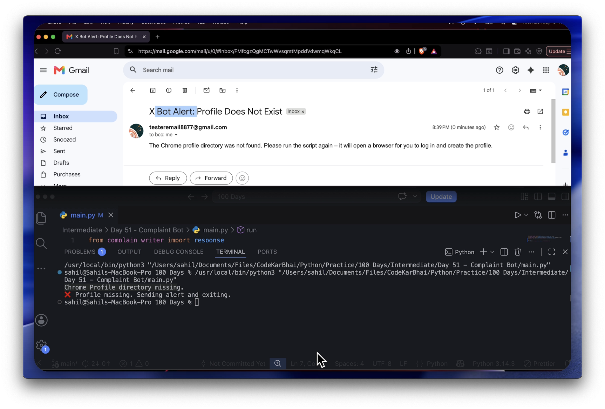
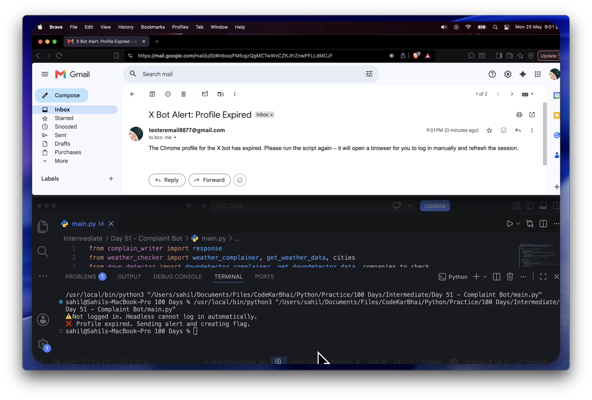
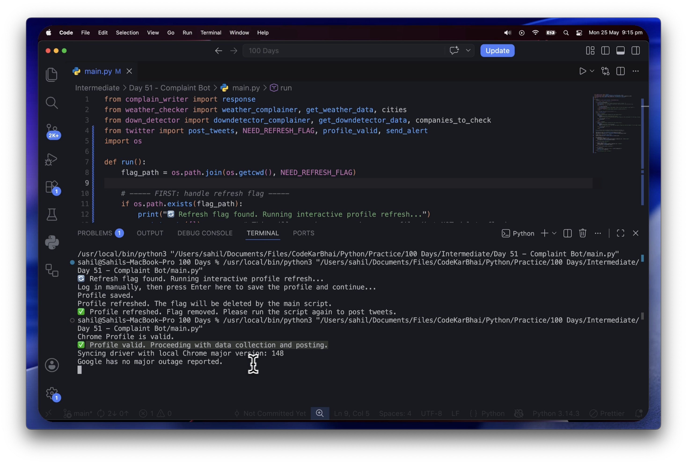
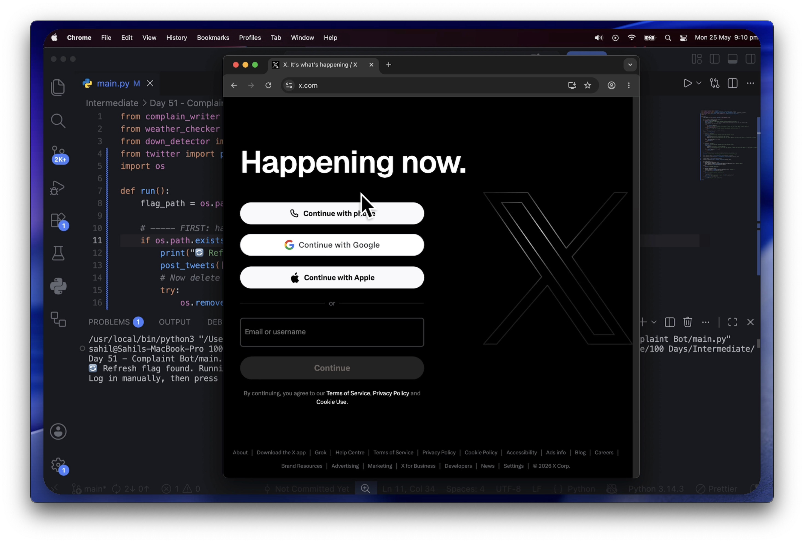
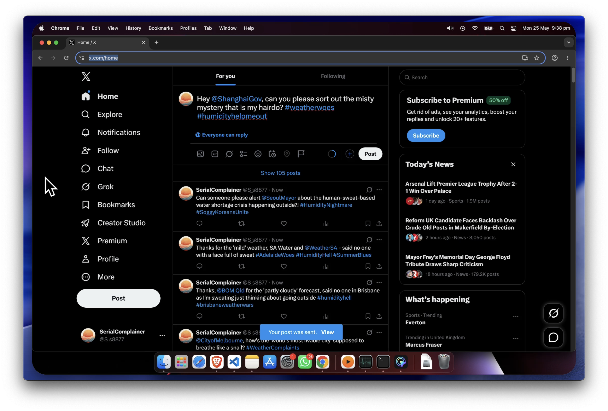

# SerialComplainer

> An automated complaint bot that monitors global service outages and extreme weather conditions, generates witty tweets using a local LLaMA 3 model, and posts them to X every 6 hours — entirely on your own machine, with no cloud costs.

[](https://www.python.org/downloads/)
[](https://opensource.org/licenses/MIT)
[]()

**No cloud costs. No API fees. Just a persistent Chrome profile, a local LLM, and automated British rage.**

---

## Table of Contents

- [What It Does](#what-it-does)
- [System Requirements](#system-requirements)
- [Demo](#demo)
- [Tech Stack](#tech-stack)
- [Project Structure](#project-structure)
- [How It Works](#how-it-works)
- [Design Decisions](#design-decisions)
- [Setup](#setup)
- [Configuration](#configuration)
- [Troubleshooting](#troubleshooting)
- [License](#license)
- [Author](#author)

---

## What It Does

| Capability | Description |
|------------|-------------|
| **Scrape Downdetector** | Monitors 20 global services for real-time outages across the UK, US, and globally |
| **Scrape weather.com** | Checks current temperature and humidity for 55 cities worldwide |
| **City-specific thresholds** | Each city has calibrated complaint thresholds — London complains at 27°C, Dubai at 42°C |
| **Local LLM inference** | Uses `llama-cpp-python` with LLaMA 3 8B — no external API calls, no per-request cost |
| **Tweet generation** | Randomly selects a tone per tweet: sarcastic, existential, passive-aggressive, British humour, and more |
| **Post to X** | Uses a persistent Chrome profile to stay logged in; no automated login after initial setup |
| **Profile state machine** | Automatically detects missing or expired sessions and emails you when manual intervention is needed |
| **Email alerts** | Gmail SMTP notifications when the Chrome profile needs attention |
| **Scheduled execution** | Runs every 6 hours via `cron` |

---

## System Requirements

| Component | Minimum |
|-----------|---------|
| OS | macOS (Intel/Apple Silicon) or Linux (Ubuntu 20.04+) |
| RAM | 8GB total (6GB needed for the LLM) |
| Disk space | 5GB free (model + Chrome profile + logs) |
| Chrome browser | Latest stable version installed locally |
| Python | 3.11 or higher |

---

## Demo

The bot manages its own login session autonomously through a state machine. Each state has a corresponding demo.

| State | Behaviour | Demo |
|-------|-----------|------|
| **Profile missing** | No profile folder found. Sends email alert, creates refresh flag, exits. | [](https://www.loom.com/share/f3eb5945b3834e15b9141b83b16a9eac) |
| **Profile expired** | Profile exists but X session invalid. Sends email alert, creates flag, exits. | [](https://www.loom.com/share/18e6a044b9f14673920f4d5386a0900f) |
| **Profile valid** | Runs headlessly, scrapes data, generates tweets, posts to X. No email. | [](https://www.loom.com/share/224e4adb68ac4a0fa94dcc35e600e348) |
| **Interactive refresh** | Flag detected — opens visible browser for manual login, saves profile, removes flag. | [](https://www.loom.com/share/591449462c334850a23647162659c4d1) |
| **Full pipeline** | Complete run from scraping to tweeting, headlessly. | [](https://www.loom.com/share/ab407ae412b147bcb232ab9484992790) |

---

## Tech Stack

| Tool | Purpose |
|------|---------|
| [Python](https://www.python.org/) | Core language |
| [Selenium](https://www.selenium.dev/) | Browser automation for weather.com scraping |
| [undetected-chromedriver](https://github.com/ultrafunkamsterdam/undetected-chromedriver) | Bot detection bypass for Downdetector and X |
| [llama-cpp-python](https://github.com/abetlen/llama-cpp-python) | Local LLM inference |
| [LLaMA 3 8B Q4_K_M](https://huggingface.co/bartowski/Meta-Llama-3-8B-Instruct-GGUF) | Tweet generation model |
| [smtplib](https://docs.python.org/3/library/smtplib.html) | Email alerts via Gmail SMTP |
| [python-dotenv](https://github.com/theskumar/python-dotenv) | Environment variable management |
| Persistent Chrome profiles | Keep X session alive without re-authenticating |
| cron | Scheduling (every 6 hours) |

---

## Project Structure

```
complaint-bot/
├── main.py                 # Orchestrates the full pipeline and profile state machine
├── down_detector.py        # Scrapes Downdetector for service outages
├── weather_checker.py      # Scrapes weather.com with city-specific thresholds
├── complain_writer.py      # LLM prompt engineering and tweet generation
├── twitter.py              # X posting logic and Chrome profile management
├── download_model.py       # Downloads LLaMA 3 model from HuggingFace
├── requirements.txt        # Python dependencies
├── assets/                 # Demo screenshots for README
│   ├── demo_profile_missing.png
│   ├── demo_profile_expire.png
│   ├── demo_valid_profile.png
│   ├── demo_rebuild_profile.png
│   └── demo_full_run.png
└── README.md
```

---

## How It Works

### Profile State Machine

The bot uses a persistent Chrome profile stored in `complaint_bot_chrome_profile/` to stay logged into X without automated login requests. On every run, `main.py` checks the profile state before doing anything else.

```
Run script
    │
    ├── .need_refresh flag exists?
    │       └── YES → open visible browser → log in manually → save profile → delete flag → exit
    │
    ├── Profile folder missing?
    │       └── YES → send email alert → create flag → exit
    │
    ├── Profile expired (X redirects to login)?
    │       └── YES → send email alert → create flag → exit
    │
    └── Profile valid
            └── scrape → generate → post → exit
```

### Data Pipeline

```
Downdetector (20 services) ──┐
                              ├──► LLaMA 3 generates tweets ──► Post to X
weather.com (55 cities) ─────┘
```

---

## Design Decisions

### Why city-specific thresholds?
A flat global threshold makes no sense — 32°C in London is a heatwave, 32°C in Dubai is a mild Tuesday. Each city in `CITY_THRESHOLDS` has calibrated `max_temp` and `max_humi` values based on what would genuinely be uncomfortable for residents. The bot only complains when conditions exceed these thresholds, keeping tweets data-driven and non-spammy.

### Why local LLM instead of GPT-4?
Paying per angry tweet felt spiritually wrong. LLaMA 3 8B at Q4_K_M quantization (~4.9GB) runs entirely on a local Mac, costs nothing per inference, and produces consistently good output for this use case. Q2_K was tried first but was too lossy to follow system prompt instructions reliably.

### Why not GitHub Actions?
Originally the bot ran on GitHub Actions. Headless Chrome in a free CI runner is unstable — memory limits, renderer crashes, and `NoSuchWindowException` errors made it unreliable beyond 5-10 Selenium operations per run. Moving to a local machine with a persistent profile eliminated these issues entirely. The trade-off is the machine must stay on, which `cron` makes effortless.

### Why persistent Chrome profile instead of automated login?
X actively rate-limits and blocks automated login attempts. After several attempts during development, both account-level and IP-level blocks were triggered. The persistent profile approach eliminates login requests entirely — Chrome loads the saved session cookie and X sees a normal returning user.

---

## Setup

### 1. Clone the repository
```bash
git clone https://github.com/Sahil8877/LLM-powered-Twitter-complaint-bot.git
cd LLM-powered-Twitter-complaint-bot
```

### 2. Install dependencies
```bash
pip install -r requirements.txt
```

### 3. Download the LLaMA model
```bash
python download_model.py
```
Downloads `Meta-Llama-3-8B-Instruct-Q4_K_M.gguf` (~4.9GB) into `model/`. Only needed once.

### 4. Configure environment variables
Create a `.env` file in the project root:
```env
SENDER_EMAIL=your.email@gmail.com
SENDER_EMAIL_PASS=your_gmail_app_password
RECEIVER_EMAIL=your.email@gmail.com
```
For Gmail, generate an [App Password](https://support.google.com/accounts/answer/185833) with 2FA enabled. Email alerts are optional but recommended — without them you won't know when the profile needs refreshing.

### 5. Run the bot
```bash
python main.py
```

**First run** — no profile folder exists. An email alert is sent and a `.need_refresh` flag is created. The script exits.

**Second run** — the flag is detected. A visible Chrome window opens. Log into X manually, then press Enter in the terminal. The profile is saved, the flag is removed. The script exits.

**Every subsequent run** — Chrome loads the saved session headlessly, scrapes data, generates tweets, and posts to X automatically.

### 6. Schedule with cron
```bash
crontab -e
```
Add:
```bash
0 */6 * * * cd /path/to/complaint-bot && /usr/local/bin/python3 main.py >> /var/log/complaint-bot.log 2>&1
```
The machine must be awake for cron to fire. On macOS, disable sleep in System Settings > Battery while the bot is running.

---

## Configuration

### Services to monitor (`down_detector.py`)
```python
companies_to_check = [
    {'Virgin Media': 'https://downdetector.co.uk/status/virgin-media/'},
    {'Google': 'https://downdetector.com/status/google/'},
]
```
Mix `.co.uk` for UK-specific services and `.com` for global ones.

### Cities to monitor (`weather_checker.py`)
```python
cities = ['London', 'Manchester', 'New York', 'Tokyo']
```

### Complaint thresholds (`weather_checker.py`)
```python
CITY_THRESHOLDS = {
    'London': {'max_temp': 27, 'max_humi': 75},
    'Dubai':  {'max_temp': 42, 'max_humi': 65},
}
```
Add any city not in the dictionary and it falls back to `DEFAULT: {'max_temp': 32, 'max_humi': 75}`.

### Tweet tones (`complain_writer.py`)
```python
tones = [
    "angry", "sarcastic", "dramatic", "passive aggressive",
    "existential", "british humour", "chronically online", "overreacting"
]
```

---

## Troubleshooting

| Problem | Likely cause | Solution |
|---------|--------------|----------|
| `NoSuchWindowException` | Chrome session closed unexpectedly | Run `python main.py` — if profile is expired, re-login via the visible browser prompt |
| Profile expired repeatedly | X session cookie lifetime is a few weeks | Re-login when prompted. Consider running the bot less frequently |
| Email not received | SMTP credentials wrong or Gmail blocking | Use an App Password; check spam folder |
| Chrome version mismatch | `get_chrome_version()` returns wrong value | Hardcode your Chrome version in `twitter.py` and `down_detector.py` |
| Model not found | Download interrupted or wrong path | Delete `model/` folder and re-run `download_model.py` |
| Cron job not running | Wrong path or machine asleep | Check `grep CRON /var/log/syslog`; disable sleep mode |
| Downdetector returns empty | Site blocked CI IP or class name changed | Run locally; check `downdetector_error.png` for what the page showed |

---

## License

MIT License — use it, break it, improve it, complain about it.

---

## Author

Built as part of the **#100DaysOfCode** challenge.
Follow the bot: [@S_s8877](https://x.com/S_s8877) — **SerialComplainer**

> *"I complain about all things life."*

---

*Made with coffee, British rage, and a healthy disrespect for CAPTCHAs.*
