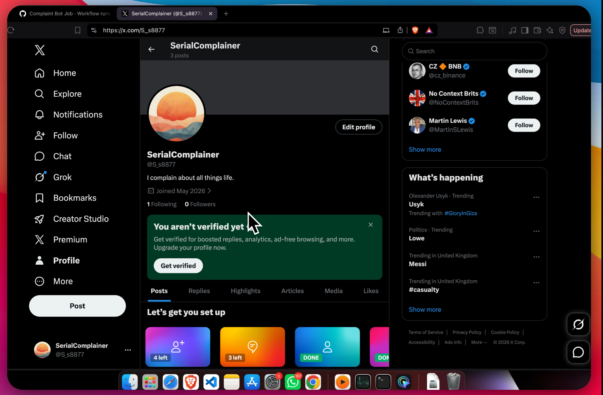

# SerialComplainer 🤖

An automated complaint bot that monitors UK service outages and bad weather,
generates witty tweets using a local LLaMA 3 model, and posts them to X (Twitter)
every 6 hours via GitHub Actions. No cloud AI costs. No manual effort. Just automated British rage.

---

## What It Does

- Scrapes [Downdetector](https://downdetector.co.uk) for real-time service outages
- Scrapes [weather.com](https://weather.com) for UK city weather conditions
- Feeds the data into a locally running LLaMA 3 8B model
- Generates complaint tweets in a randomly selected tone (sarcastic, dramatic, existential, passive aggressive, and more)
- Posts each tweet automatically to X
- Runs every 6 hours via GitHub Actions, completely hands-free

---

## Demo

[](https://www.loom.com/share/3c7c2ac806124f1399f050e6773263ed)

---

## Tech Stack

| Tool | Purpose |
|---|---|
| Python | Core language |
| Selenium | Web scraping |
| undetected-chromedriver | Bot detection bypass |
| llama-cpp-python | Local LLM inference |
| LLaMA 3 8B (Q4_K_M) | Tweet generation |
| GitHub Actions | Scheduled automation |
| Xvfb | Virtual display for headless Chrome |

---

## Project Structure
```
complaint-bot/
├── main.py                 # Orchestrates the full pipeline
├── down_detector.py        # Scrapes Downdetector for outages
├── weather_checker.py      # Scrapes weather.com for UK cities
├── complain_writer.py      # LLM tweet generation
├── twitter.py              # Posts tweets to X via Selenium
├── download_model.py       # Downloads LLaMA model from HuggingFace
├── requirements.txt        # Python dependencies
└── .github/
└── workflows/
└── complaint-bot.yml  # GitHub Actions workflow
```

---

## How It Works
```
Downdetector + weather.com
↓
Selenium scrapes live data
↓
LLaMA 3 generates tweet
(random tone each run)
↓
Posted to X automatically
↓
Repeats every 6 hours
```
---

## Setup

### 1. Clone the repo
```bash
git clone https://github.com/yourusername/complaint-bot.git
cd complaint-bot
```

### 2. Install dependencies
```bash
pip install -r requirements.txt
```

### 3. Download the model
```bash
python download_model.py
```
This downloads `Meta-Llama-3-8B-Instruct-Q4_K_M.gguf` (~4.9GB) from HuggingFace
into a `model/` directory.

### 4. Add your X credentials as GitHub Secrets

Go to your repo > Settings > Secrets and Variables > Actions and add:

| Secret | Value |
|---|---|
| `X_PASS_EMAIL` | Your X login email |
| `X_PASS` | Your X password |

### 5. Enable GitHub Actions

The workflow runs automatically every 6 hours. You can also trigger it
manually from the Actions tab using `workflow_dispatch`.

---

## Configuration

**Add or remove services to monitor** in `down_detector.py`:
```python
companies_to_check = [
    {'Apex Legends': 'https://downdetector.co.uk/status/apex-legends/'},
    {'Virgin Media': 'https://downdetector.co.uk/status/virgin-media/'},
]
```

**Add or remove cities** in `weather_checker.py`:
```python
uk_cities = ['London', 'Glasgow']
```

**Change tweet tones** in `complain_writer.py`:
```python
tones = [
    "angry", "sarcastic", "dramatic",
    "passive aggressive", "existential",
    "british humour", "chronically online", "overreacting"
]
```

---

## Challenges Solved

- Bypassing bot detection on Downdetector using `undetected-chromedriver`
- Handling nested cookie consent iframes with Selenium frame switching
- Preventing Chrome renderer crashes in GitHub Actions with shared memory tuning
- Dynamically detecting Chrome version to avoid `chromedriver` mismatches
- Running LLaMA 3 locally in CI with HuggingFace model caching

---

## Notes

- The model runs entirely locally during the GitHub Actions job. No external AI API calls are made.
- The model is cached between runs using GitHub Actions cache to avoid re-downloading 4.9GB every 6 hours.
- This project was built for learning purposes as part of my 100 Days of Python challenge.

---

